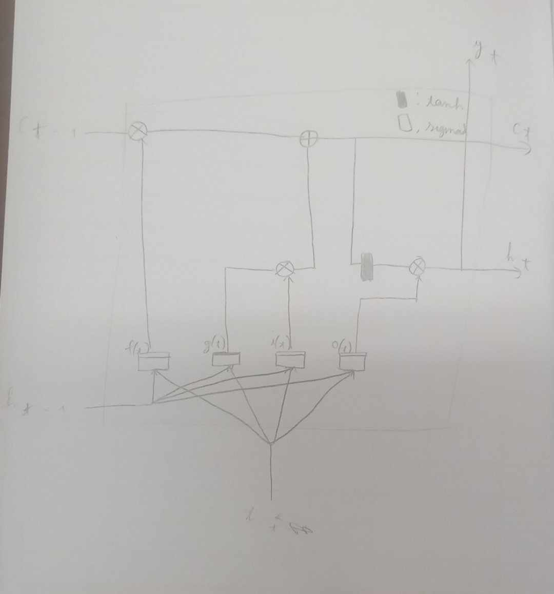

1. These are a few applications for RNNs:
- Sequence-to-sequence: Audio-to-text, translation, forecasting a time series, music generation (or other sequence generation), text-to-video, video captioning.
- Sequence-to-vector: Text-to-image, sentiment analysis, classifying music genres, predicting the probability a user will want to watch a mve based on their watch (and search) history.
- Vector-to-sequence: Image captioning, produce a list of music playlist based an embedding of the current artist, locating pedestrians in a picture.
2. 
- The inputs of an RNN layer must have 3 dimensions.
- They are batch size, time step and dimensionality in that order.
- The outputs' size is 3, and the meaning are the same for the first two dimensions, but the last one is the number of neurons.
3.
- A deep sequence-to-sequence RNN must have `return_sequences=True` for all of its layers.
- A sequence-to-vector one also needs to have `return_sequences=True` for all of its layers, expect for the last one, which should be set to `return_sequences=False`, or don't set it, `False` is the default value.
4. You generally have two choices:
- Sequence-to-vector: Build a stack of RNN, set all of them with `return_sequences=True`, expect for the last one. The number of neuron in the last layer will be the number of days you want to forecast (7 it is). This is the simplest choice. You can then train this model using random windows from the time series (for example, using 30 consecutive days as inputs and the next 7 days as outputs).
- Sequence-to-sequence: Also build the same stack of RNN, just set all of them with `return_sequences=True` instead. Just remember to set each element in the target sequence to a sequence the length of 7 (the days you want the model to forecast).
5. There are two main difficulties when training RNNs:
- Unstable gradients: Gradients can be vanish or explode easily. You can use gradient clipping, switch to a nonsaturating activation function such as hyperbolic tangent function (which is the default), use a smaller learning rate, Layer Normalization, or Dropout ar each time step.
- Limited short-term memory: RNNs tend to have a fairly short memory. You can use LSTM or GRU, these also help dealing with unstable gradient.
6. The sketch is not so great:

We just need to think some things in the process:
    - The unique property of LSTM is the four gates.
    - You just remember that there's long-term memory, so we need a forget gate.
    - One gate to accept the input.
    - Another to alter the input.
    - The last one to tweak the output for short-term memory, and also the output.
    - The gate with alter something need to be activated by the sigmoid activation function, so the weights are in the [0, 1] interval.
    - The activation function for the computation layers however need to be the hyperbolic tanh function, to deal with unstable gradient problem.
    - After the forget and add memory gates, we've done with the long-term gate. The output gate deal with the same long-erm memory and create the short-term one and the output.
7. Here are some reasons I want to use 1D convolutional layers in an RNN:
- The nature of RNNs is sequential: you need all the previous time steps to produce the next time steps, which make it unable to parallelize. Convolutional layers are not, so we can parallelize it with ease.
- In fact, convolutional layer does not have any memory: the output can be computed based only from a small number of values from the input windows without having to know all the past values.
- Moreover, since 1D convolutional layers are nto recurrent, they suffer less form the unstable gradient problem.
- 1D convolutional layers can also be used to preprocess the inputs, for example, reduce their temporal resolution and thereby help them identify long-term patterns.
- We can actually use only convolutional layers, as in the WaveNet.
8.
- Classifying video can be thought as using a sequence of vectors (images) to output a vector (the prediction probability).
- A possible architecture is as followed: Take a sequence of images, pass each of them to the same convolutional neural network, then pass the sequence of outputs to a sequence-to-vector RNN, finally run the result through a softmax layer to receive all the class probabilities.
- And of course, use the cross entropy as the loss function.
- If you want to also add the audio as well, you should use a stack of 1D convolutional layers with appropriate strides to reduce the temporal resolution from thousands of audio frames to just one per second (to match the number of images per second), and concatenate the outputs to the inputs of the sequence-to-vector RNN (along the last dimension).
